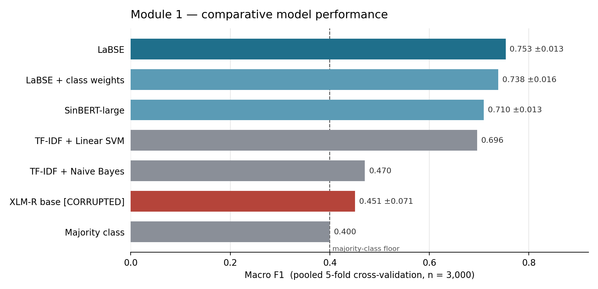
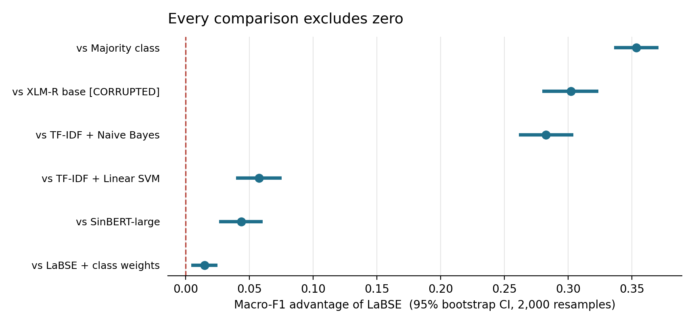
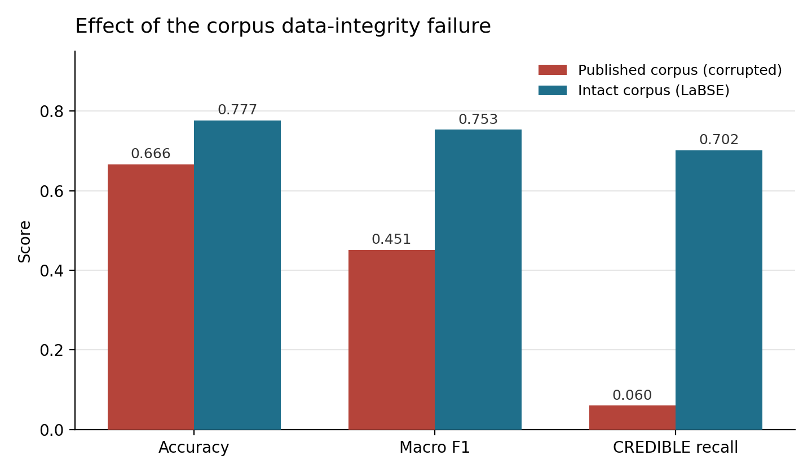

# R26-IT-158 — SinhalaCheck

**Module 1: NLP Content Credibility Analysis**
Kaweeshwara P.D.S. (IT22331304) · Team Leader · B.Sc. (Hons) in Information Technology, SLIIT

An AI-powered system for detecting misinformation in Sinhala-language news and social media.
This branch holds Module 1 — content credibility — plus the integrated application that
combines all modules into one running system.

---

## Results

LaBSE fine-tuned on the LIRNEasia Sinhala Misinformation Corpus, binary classification
(`CREDIBLE` = 1). Selected by **5-fold cross-validation over all 3,000 documents** at 512
tokens; every figure below is computed from pooled out-of-fold predictions.

| Model | Accuracy | Macro-F1 | fold σ |
|---|---|---|---|
| **LaBSE** | **0.7767** | **0.7534** | 0.013 |
| LaBSE + class weights | 0.7520 | 0.7384 | 0.016 |
| SinBERT-large | 0.7287 | 0.7095 | 0.013 |
| TF-IDF + Linear SVM *(baseline)* | 0.7217 | 0.6958 | — |
| TF-IDF + Naive Bayes *(baseline)* | 0.6793 | 0.4705 | — |
| XLM-R base, damaged CSV *(control)* | 0.6663 | 0.4509 | 0.071 |
| Majority class | 0.6657 | 0.3996 | — |



### Statistical validation

Significance is tested by **paired bootstrap on macro-F1** (2,000 resamples over the 3,000
pooled predictions). McNemar's test is reported as a secondary check and agrees throughout.

| Comparison | Macro-F1 gap | 95% CI | p |
|---|---|---|---|
| vs Majority class | +0.354 | [0.336, 0.371] | < 0.0001 |
| vs damaged-CSV control | +0.302 | [0.280, 0.324] | < 0.0001 |
| vs TF-IDF + Naive Bayes | +0.283 | [0.262, 0.304] | < 0.0001 |
| vs TF-IDF + Linear SVM | +0.058 | [0.040, 0.076] | < 0.0001 |
| vs SinBERT-large | +0.044 | [0.026, 0.060] | < 0.0001 |



Bootstrap is the primary test rather than McNemar because the claim concerns *where* errors
fall, not how many there are: a model can correct its class balance without changing its
error count, and McNemar cannot see that difference.

Candidate models follow *BERTifying Sinhala* (Dhananjaya et al., LREC 2022).

---

## A data-integrity hazard in the published corpus

The LIRNEasia repository distributes the corpus in two formats, with no warning on either:

| File | Sinhala text per document |
|---|---|
| `Corpus.csv` | **0.0 characters** — every codepoint replaced by `?` |
| `Corpus.xlsx` | 1,714 characters — intact |

Same 3,000 documents, same order, same labels, verified row by row.

The CSV is the format most naturally consumed programmatically, and the failure is silent: a
model trained from it does not error. It trains, reports plausible accuracy, and has learned
nothing from the text.



Note that **accuracy barely moves** (0.666 → 0.777) while macro-F1 nearly doubles
(0.451 → 0.753) and recall on CREDIBLE rises more than tenfold (0.060 → 0.702). The damaged
model scored respectably by rarely predicting CREDIBLE at all. Reporting accuracy alone would
have hidden the failure completely — which is why macro-F1 is the headline metric here.

---

## The integrated application

Three services behind one interface. See [`sinhalacheck/README.md`](sinhalacheck/README.md).

```
   browser ──► fusion :8000 (+ UI) ──┬──► module1 :8001   content credibility (LaBSE)
                                     └──► module2 :8002   source + temporal (RF + rules)
```

```bash
cd sinhalacheck
pip install -r requirements.txt
python run_all.py
```

Design decisions worth noting, each answering a specific review finding:

- **Modules are called over HTTP, not imported.** An earlier prototype loaded Module 1's
  weights directly into the fusion process, which erases the module boundary and stops Module 1
  being independently deployable or measurable.
- **Fusion weights carry their provenance.** Every response includes `weights_provenance` with
  an `is_fitted` flag, and the UI warns while weights are unfitted placeholders.
- **Missing signals are dropped, not faked.** A pasted WhatsApp forward has no URL, so Module 2
  cannot contribute; fusion renormalises over the signals present rather than substituting a
  neutral 0.5 that would drag every verdict toward the middle.

---

## The model

The trained weights are ~1.9GB, beyond GitHub's 100MB file limit, so the model is published to
the Hugging Face Hub:

**https://huggingface.co/Kaweeshwara/sinhalacheck-module1**

```python
from transformers import AutoModelForSequenceClassification, AutoTokenizer
m = AutoModelForSequenceClassification.from_pretrained("Kaweeshwara/sinhalacheck-module1")
t = AutoTokenizer.from_pretrained("Kaweeshwara/sinhalacheck-module1")
```

`Kaweeshwara/sinhalacheck-module1` is also Module 1's default source, so the application runs
with no manual model setup.

---

## Reproducing

[`notebooks/SinhalaCheck_Module1_Validated.ipynb`](notebooks/SinhalaCheck_Module1_Validated.ipynb)
runs end to end on a Colab T4 with **no manual input** — it downloads both corpus
distributions itself. Roughly 90–120 minutes.

| Notebook | Purpose |
|---|---|
| `SinhalaCheck_Module1_Validated.ipynb` | Full experiment: screening, 5-fold CV, bootstrap, figures |
| `SinhalaCheck_Module1_Retrain.ipynb` | Earlier single-split run, kept for provenance |
| `SinhalaCheck_Refit_Final.ipynb` | Refits the selected configuration and publishes it |

---

## Known limitations

Stated here rather than left for a reader to find.

**Misinformation detection is weaker than headline accuracy suggests.** The corpus contains
1,887 `UNCERTAIN` documents against only 110 `FALSE`/`PARTIAL`, so the binary task is largely
*credible vs uncertain* rather than *credible vs false*. On the 110 genuinely false documents
the model's detection rate is materially lower than its overall accuracy.
`scripts/analyse_operating_point.py` measures whether a better decision threshold exists.

**Fusion weights cannot be fitted from this corpus.** Its labels describe content credibility,
not publisher reliability or recirculation, so there is nothing to fit source and temporal
weights against — source credibility reaches only 0.535 ROC-AUC on this target, against 0.500
for chance. Sensitivity analysis is used instead of a fitted claim.

**Module 2's knowledge base covers 19.9% of corpus publishers.** 24 domains are curated;
major outlets including `aruna.lk`, `ravaya.lk` and `divaina.lk` are absent, so most documents
fall back to a constant. See
[`sinhalacheck/services/module2/MISSING_DOMAINS.md`](sinhalacheck/services/module2/MISSING_DOMAINS.md)
— adding ten domains raises coverage to about 70%.

---

## Team

| Student ID | Name | Component |
|---|---|---|
| IT22331304 | Kaweeshwara P.D.S. | Module 1 — NLP content credibility *(this branch)* |
| IT22370778 | Caldera S.T.H | Module 2 — source credibility & temporal verification |
| IT22259752 | Wishmitha | Module 4 — fusion, XAI explanation & user application |

Module 2's service is vendored unmodified from the `caledra` branch so the integrated
application runs from a single checkout.
